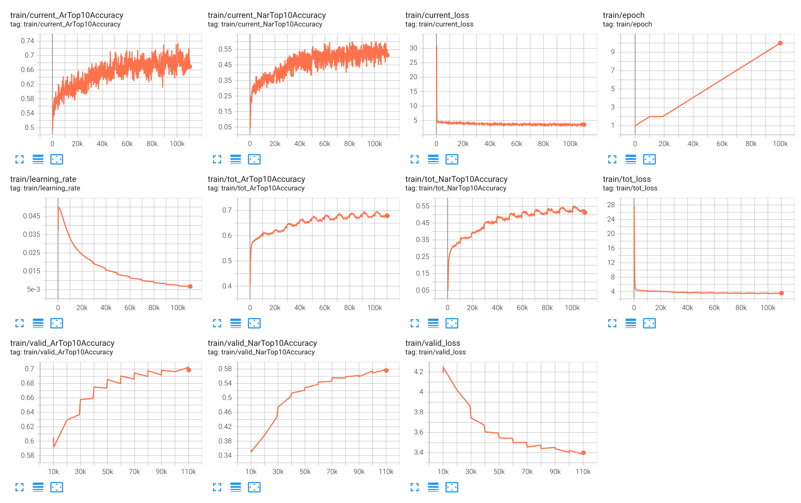

# Speech Synthesis using Vall-E


## Dataset - [LibriTTS corpus](https://www.openslr.org/60/)
- Summary: Large-scale corpus of English speech derived from the original materials of the LibriSpeech corpus

About this resource:
    LibriTTS is a multi-speaker English corpus of approximately 585 hours of read English speech at 24kHz sampling rate, prepared by Heiga Zen with the assistance of Google Speech and Google Brain team members. The LibriTTS corpus is designed for TTS research. It is derived from the original materials (mp3 audio files from LibriVox and text files from Project Gutenberg) of the LibriSpeech corpus. The main differences from the LibriSpeech corpus are listed below:
- The audio files are at 24kHz sampling rate.
- The speech is split at sentence breaks.
- Both original and normalized texts are included.
Contextual information (e.g., neighbouring sentences) can be extracted.
- Utterances with significant background noise are excluded.

    ### Data Preparation
    ```
    #!\bin\bash

    cd vall-e/examples/libritts
    # step1 prepare dataset
    bash prepare.sh --stage -1 --stop-stage 3
    ```

## Training and inference
```
#!\bin\bash

# step2 train the model on one GPU with 24GB memory
exp_dir=exp/valle

```

### Training AR model
```
#!\bin\bash
python3 bin/trainer.py --max-duration 80 --filter-min-duration 0.5 --filter-max-duration 14 --train-stage 1 \
      --num-buckets 6 --dtype "bfloat16" --save-every-n 300000 --valid-interval 20000 \
      --model-name valle --share-embedding true --norm-first true --add-prenet false \
      --decoder-dim 1024 --nhead 16 --num-decoder-layers 12 --prefix-mode 1 \
      --base-lr 0.05 --warmup-steps 200 --average-period 0 \
      --num-epochs 100 --start-epoch 1 --start-batch 0 --accumulate-grad-steps 4 \
      --exp-dir ${exp_dir}
```

### Train NAR model
```
cp ${exp_dir}/best-valid-loss.pt ${exp_dir}/epoch-2.pt  
# --start-epoch 3=2+1
export start-epoch=3
python3 bin/trainer.py --max-duration 40 --filter-min-duration 0.5 --filter-max-duration 14 --train-stage 2 \
      --num-buckets 6 --dtype "float32" --save-every-n 10000 --valid-interval 20000 \
      --model-name valle --share-embedding true --norm-first true --add-prenet false \
      --decoder-dim 1024 --nhead 16 --num-decoder-layers 12 --prefix-mode 1 \
      --base-lr 0.05 --warmup-steps 200 --average-period 0 \
      --num-epochs 50 --start-epoch ${start-epoch} --start-batch 0 --accumulate-grad-steps 4 \
      --exp-dir ${exp_dir}
```

### Inference
- NAR Inferences are inside [Infer](./infer)
```
export model-name="best-valid-loss"
export prompt_annotation="KNOT one point one five miles per hour."
export prompt_name="8463_294825_000043_000000.wav"
python3 bin/infer.py --output-dir infer/demos \
    --model-name valle --norm-first true --add-prenet false \
    --share-embedding true --norm-first true --add-prenet false \
    --text-prompts {prompt_annotation} \
    --audio-prompts vall-e/egs/libritts/prompts/{prompt_name} \
    --text "To get up and running quickly just follow the steps below." \
    --checkpoint=${exp_dir}/{model-name}.pt
```

- The following experiment has been run on [Vast.ai](https://cloud.vast.ai/create/) instance with Nvidia 3090 GPU with 24GB VRAM and 32GB RAM
- To Replicate the experiment create a docker container using the [Dockerfile](Dockerfile) and use it to spin up and instance at vast.ai cloud


